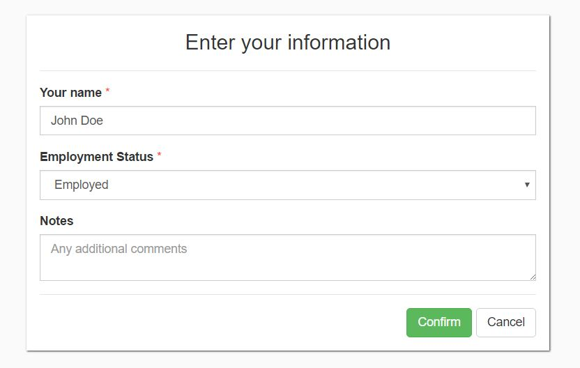
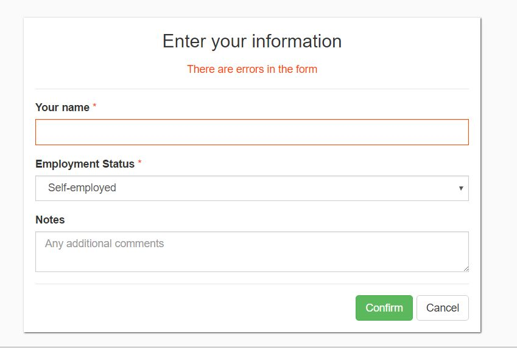

# React + Bootstrap powered popup form component
<br>



<br>

## Example Usage

```javascript
import React from 'react';
import ReactDOM from 'react-dom';
import DynamicForm from 'jsx-dynamic-form';
import data from './data';

import './index.css';

function onConfirmCallback(data) {
  console.log(data);
};

function onCancelCallback() {
  console.log('cancelled');
};

function onDeleteCallback() {
  console.log('deleted');
}

ReactDOM.render(
  <DynamicForm
  definition={data.definition}
  data={data.data}
  onConfirmCallback={onConfirmCallback}
  onCancelCallback={onCancelCallback}
  onDeleteCallback={onDeleteCallback}/>, document.getElementById('root'));

```

## Example Form Definition

```javascript
const definition = {
    title: 'Enter your information',
    overlay: true,
    confirmButtonText: 'Confirm',
    cancelButtonText: 'Cancel',
    isOpen: true,
    fields: [{
        type: 'TextInput',
        name: 'UserName',
        label: 'Your name',
        required: true
    }, {
        type: 'Dropdown',
        name: 'EmploymentStatus',
        label: 'Employment Status',
        options: [
            {
                display: 'Employed',
                value: 'Employed'
            }, {
                display: 'Unemployed',
                value: 'Unemployed'
            }, {
                display: 'Self-employed',
                value: 'SelfEmployed'
            }
        ],
        value: 'Employed',
        required: true
    }, {
        type: 'TextArea',
        name: 'Notes',
        label: 'Notes',
        value: '',
        placeholder: 'Any additional comments'
    }]
};

const data = {  
    UserName: 'John Doe'
};

export default {
    definition,
    data,
}

```

## Definition file explained

In the usual circumstances the definition file will not contain any data, just the static form definition. The data is located here just for demonstrational purposes, showing how data prepopulation can be used with the popup. The matching between provided data vs form definition element is based on the "name" property of the definition field.

## Supported definition properties

| Attribute | Default Value | Description | Required |
| --------- | ------------- | ----------- | -------- |
| title     | ''            | Popup header title | true |
| overlay   | true         | Whether an overlay is added to the page | false |
| isOpen    | false         | Whether the popup is visible | false |
| confirmButtonText    |          | The text displayed on the button | true |
| cancelButtonText    |          | The text displayed on the button. If none is provided, the button will not be rendered | false |
| deleteButtonText    |         | The text displayed on the button. If none is provided, the button will not be rendered | false |
| fields | [] | The fields which will be displayed in the form. If none are provided, no fields will be rendered, just the buttons | false |

## Supported field properties and types

* TextInput
* NumberInput
* TextArea
* FreeText
* Dropdown

| Attribute | Default Value | Description | Required |
| --------- | ------------- | ----------- |-----------|
| type      |              | One of the 5 types mentioned | true |
| name      |               | Unique name for internal use. The data returned after confirmation is mapped with those names| true |
| label     |               | The label for the form control | false |
| required  |        | Whether the component can have empty value when confirming the whole form | false |
| placeholder |        | Placeholder text for the form component | false |

#### Dropdown options

| Attribute | Default Value | Description | Required |
| --------- | ------------- | ----------- | -------- |
| displayName |     | How the end user sees the option | true |
| value  |     | What is the actual value for the option | true |

## Built-in validation

There is a basic validation at the moment: if a field is marked as required and is empty - the form cannot be submitted.

<br>



<br>
